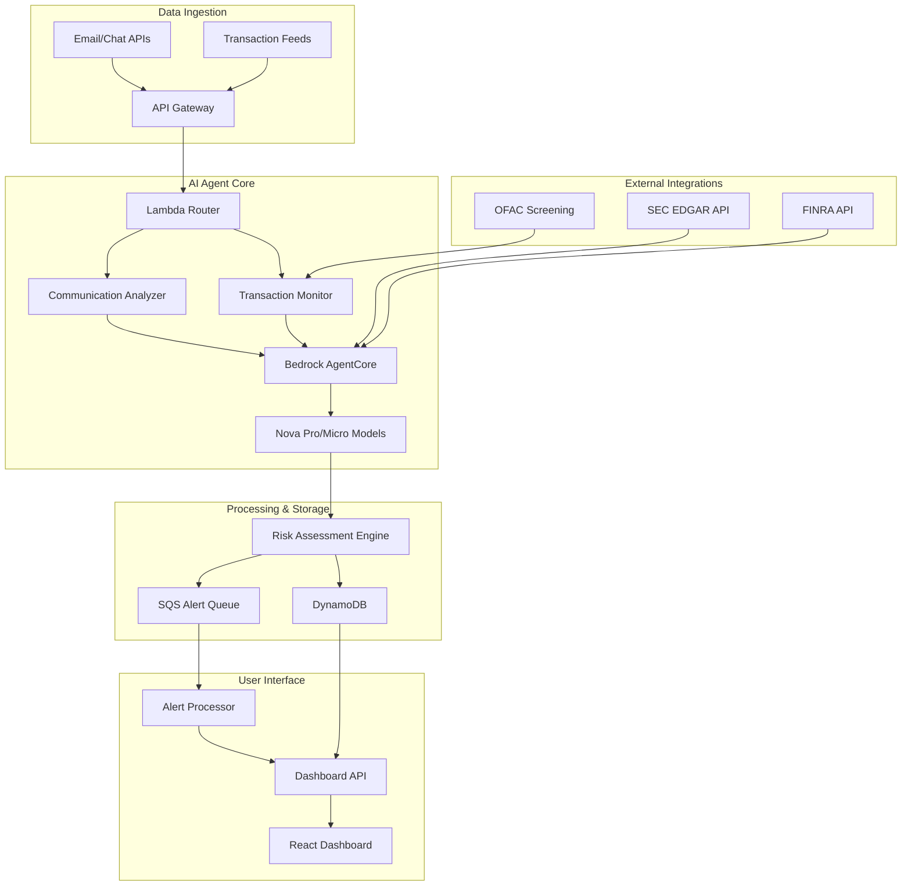

# Design Document

## Overview

The Intelligent Compliance and Risk Agent is designed as a serverless, event-driven system on AWS that leverages AI agents for autonomous compliance monitoring. The architecture prioritizes real-time processing, cost efficiency, and explainable AI decisions while maintaining enterprise-grade security and scalability.

The system processes two primary data streams: business communications (emails, chats, documents) and financial transactions. Each stream flows through specialized AI analysis pipelines that use Amazon Bedrock AgentCore for orchestration and Nova models for reasoning, ultimately feeding into a unified risk assessment and alerting system.

## Architecture

### High-Level Architecture



### AWS Services Integration

**Core AI Services:**
- **Amazon Bedrock AgentCore**: Orchestrates multi-step compliance analysis workflows, maintains conversation context, and manages agent memory for complex reasoning tasks
- **Amazon Bedrock Nova Pro**: Primary reasoning engine for contextual analysis of communications and complex pattern detection
- **Amazon Bedrock Nova Micro**: Lightweight scoring and classification tasks, secondary validation of risk assessments
- **Amazon Q Business**: Regulatory knowledge base for natural language policy queries and citation generation

**Serverless Compute & Storage:**
- **AWS Lambda**: Event-driven processing functions with automatic scaling and pay-per-use pricing
- **Amazon DynamoDB**: NoSQL database with single-digit millisecond latency and automatic scaling
- **Amazon SQS**: Message queuing for reliable, asynchronous processing of alerts and notifications
- **Amazon S3**: Document storage, static website hosting, and data archival with lifecycle policies

**API & Security:**
- **Amazon API Gateway**: RESTful API layer with built-in throttling, authentication, and monitoring
- **AWS IAM**: Role-based access control with least-privilege principles
- **AWS KMS**: Encryption key management for data at rest and in transit
- **Amazon CloudTrail**: Comprehensive audit logging for compliance and security monitoring

## Components and Interfaces

### 1. Communication Analyzer

**Purpose**: Processes business communications using advanced NLP and contextual understanding to detect subtle compliance violations.

**Key Components:**
- **Message Preprocessor**: Sanitizes and normalizes input text, extracts metadata (sender, timestamp, attachments)
- **Context Enricher**: Adds relevant business context (employee roles, recent transactions, regulatory history)
- **AI Analysis Engine**: Uses Bedrock AgentCore to orchestrate multi-step analysis workflow
- **Risk Classifier**: Applies Nova Pro reasoning to generate risk scores and regulatory citations

**Input Interface:**
```json
{
  "messageId": "string",
  "content": "string",
  "metadata": {
    "sender": "string",
    "recipients": ["string"],
    "timestamp": "ISO8601",
    "messageType": "email|chat|document"
  },
  "attachments": ["base64EncodedContent"]
}
```

**Output Interface:**
```json
{
  "analysisId": "string",
  "riskLevel": "LOW|MEDIUM|HIGH|CRITICAL",
  "confidence": 0.95,
  "violations": [
    {
      "type": "EARNINGS_MANIPULATION",
      "regulation": "SEC Rule 10b-5",
      "explanation": "Natural language explanation",
      "evidence": ["highlighted text segments"]
    }
  ],
  "processingTime": 3.2
}
```

### 2. Transaction Monitor

**Purpose**: Real-time analysis of financial transactions for money laundering, structuring, and suspicious activity patterns.

**Key Components:**
- **Transaction Aggregator**: Groups related transactions by account, time windows, and geographic patterns
- **Pattern Detector**: Identifies structuring, velocity anomalies, and geographic risk indicators
- **Behavioral Analyzer**: Uses Nova models to detect deviations from customer baseline behavior
- **Regulatory Checker**: Validates against BSA thresholds, OFAC lists, and AML requirements

**Input Interface:**
```json
{
  "transactionId": "string",
  "amount": 9500.00,
  "currency": "USD",
  "type": "CASH_DEPOSIT",
  "account": {
    "id": "string",
    "customerId": "string",
    "riskProfile": "LOW|MEDIUM|HIGH"
  },
  "location": {
    "country": "US",
    "state": "NY",
    "city": "New York"
  },
  "timestamp": "ISO8601"
}
```

**Output Interface:**
```json
{
  "alertId": "string",
  "alertType": "STRUCTURING|VELOCITY|GEOGRAPHIC|BSA_REPORTING",
  "riskScore": 0.88,
  "requiredActions": ["CTR_FILING", "ENHANCED_DUE_DILIGENCE"],
  "relatedTransactions": ["transactionId1", "transactionId2"],
  "explanation": "Multiple cash deposits under $10k threshold detected within 4-hour window"
}
```

### 3. Risk Assessment Engine

**Purpose**: Unified risk scoring and decision-making component that combines communication and transaction analysis results.

**Key Components:**
- **Multi-Source Aggregator**: Combines risk signals from communications and transactions
- **Contextual Scorer**: Applies business context and historical patterns to refine risk assessments
- **Threshold Manager**: Configurable risk thresholds for different violation types and customer segments
- **Alert Generator**: Creates prioritized alerts with recommended actions and escalation paths

**Processing Logic:**
1. Receive analysis results from Communication Analyzer and Transaction Monitor
2. Apply contextual weighting based on customer risk profile and historical behavior
3. Cross-reference with external regulatory data sources (SEC, FINRA, OFAC)
4. Generate final risk score using ensemble method combining multiple AI model outputs
5. Trigger appropriate alerts and notifications based on configurable thresholds

### 4. Dashboard Interface

**Purpose**: Real-time web application for compliance officers to monitor alerts, analyze trends, and interact with the AI agent.

**Key Components:**
- **Alert Dashboard**: Real-time display of compliance violations with filtering and sorting capabilities
- **Interactive Analyzer**: Text input interface for immediate compliance analysis of new communications
- **Metrics Visualization**: Charts and KPIs showing false positive rates, cost savings, and processing volumes
- **Demo Mode**: Pre-configured scenarios for hackathon demonstration with consistent results

**Technology Stack:**
- **Frontend**: React 18 with TypeScript, Material-UI components for consistent design
- **State Management**: React Query for server state, Zustand for client state
- **Real-time Updates**: Polling-based updates every 5 seconds (WebSocket upgrade optional)
- **Hosting**: Amazon S3 static website with CloudFront CDN for global performance

## Data Models

### Communication Analysis Record
```typescript
interface CommunicationAnalysis {
  id: string;
  messageId: string;
  content: string;
  sender: string;
  recipients: string[];
  timestamp: Date;
  riskLevel: 'LOW' | 'MEDIUM' | 'HIGH' | 'CRITICAL';
  confidence: number;
  violations: Violation[];
  processingTime: number;
  agentSessionId: string;
  createdAt: Date;
  ttl: number; // DynamoDB TTL for automatic cleanup
}

interface Violation {
  type: string;
  regulation: string;
  explanation: string;
  evidence: string[];
  confidence: number;
}
```

### Transaction Alert Record
```typescript
interface TransactionAlert {
  id: string;
  transactionIds: string[];
  alertType: 'STRUCTURING' | 'VELOCITY' | 'GEOGRAPHIC' | 'BSA_REPORTING';
  riskScore: number;
  customerId: string;
  accountId: string;
  totalAmount: number;
  timeWindow: {
    start: Date;
    end: Date;
  };
  requiredActions: string[];
  explanation: string;
  status: 'OPEN' | 'INVESTIGATING' | 'RESOLVED' | 'FALSE_POSITIVE';
  createdAt: Date;
  updatedAt: Date;
}
```

### Agent Session Context
```typescript
interface AgentSession {
  sessionId: string;
  customerId?: string;
  conversationHistory: Message[];
  contextData: {
    recentTransactions: Transaction[];
    riskProfile: CustomerRiskProfile;
    regulatoryHistory: RegulatoryEvent[];
  };
  createdAt: Date;
  lastActivity: Date;
  ttl: number;
}
```

## Error Handling

### Communication Analysis Errors
- **Model Timeout**: Fallback to Nova Micro for basic keyword analysis if Nova Pro exceeds 5-second timeout
- **Content Parsing Errors**: Log error details, return LOW risk classification with explanation
- **Rate Limiting**: Implement exponential backoff with jitter for Bedrock API calls
- **Invalid Input**: Validate message format and return structured error response

### Transaction Processing Errors
- **Data Quality Issues**: Flag incomplete transactions for manual review, continue processing valid data
- **External API Failures**: Cache recent OFAC/regulatory data, use cached results during outages
- **Volume Spikes**: Auto-scale Lambda concurrency, queue excess transactions in SQS for processing
- **Database Errors**: Implement retry logic with circuit breaker pattern for DynamoDB operations

### System-Level Error Handling
- **Lambda Function Failures**: Dead letter queues for failed invocations, CloudWatch alarms for error rates
- **API Gateway Errors**: Structured error responses with correlation IDs for troubleshooting
- **Authentication Failures**: Detailed logging without exposing sensitive information
- **Resource Exhaustion**: Auto-scaling policies with cost controls to prevent budget overruns

## Testing Strategy

### Unit Testing
- **AI Model Integration**: Mock Bedrock responses for consistent test results
- **Business Logic**: Test risk scoring algorithms with known input/output pairs
- **Data Validation**: Verify input sanitization and output format compliance
- **Error Scenarios**: Test all error handling paths with simulated failures

### Integration Testing
- **End-to-End Workflows**: Test complete communication analysis pipeline from input to alert generation
- **External API Integration**: Test regulatory data source integration with mock services
- **Database Operations**: Verify DynamoDB read/write operations and TTL behavior
- **Authentication Flow**: Test JWT token validation and role-based access control

### Performance Testing
- **Load Testing**: Simulate 100+ concurrent communications analysis requests
- **Stress Testing**: Test system behavior at 10x normal volume
- **Latency Testing**: Verify sub-5-second response times for all analysis operations
- **Cost Testing**: Monitor AWS service usage to ensure budget compliance

### Demo Scenario Testing
- **Earnings Manipulation**: Verify consistent detection of "delay booking that loss" with 90%+ confidence
- **Transaction Structuring**: Test multiple $9,500 deposits triggering AML alerts
- **False Positive Prevention**: Ensure legitimate business communications remain LOW risk
- **Dashboard Responsiveness**: Verify real-time updates and mobile compatibility

### Security Testing
- **Input Validation**: Test SQL injection, XSS, and other common attack vectors
- **Authentication Bypass**: Attempt unauthorized access to protected endpoints
- **Data Encryption**: Verify encryption at rest and in transit
- **Audit Logging**: Ensure all sensitive operations are logged to CloudTrail

The testing strategy emphasizes automated testing for core functionality while maintaining manual testing for demo scenarios to ensure consistent hackathon presentation results.